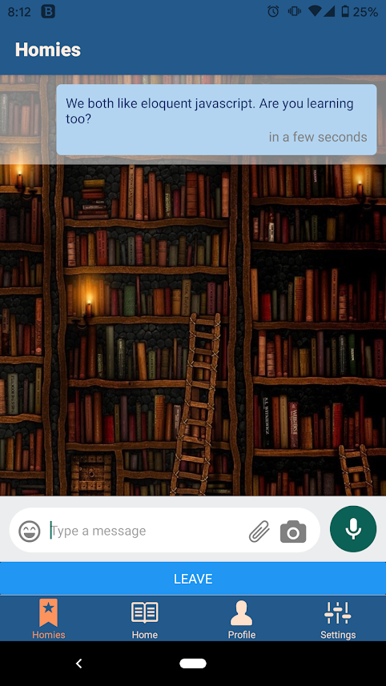

[App in play store](https://play.google.com/store/apps/details?id=com.cc18.yomihomies)
# YomiHomies                  
A matching app to connect with others based on the books you love! Set up your profile and add your favorite books, authors, and genres. Then start swiping to find some homies. Once matched, you can chat with your new homie. 

Technology used:
- React Native
- Expo 
- Google books api
- AWS Amplify
  - Cognito for authentication 
  - DynamoDB with AppSync and a GraphQL API

         

## Installation
clone this repository
```javascript
git clone https://github.com/Book-Meet/YomiHomies.git
```
install dependencies
```javascript
npm install
```
install the expo cli
```javascript
npm install --global expo-cli
```
install the expo go app on your smartphone for testing.

### Serverless Backend on AWS Amplify
You'll need to set up your own backend. In our case, we used AWS Amplify. You'll have to set up an account and configure your settings. What you'll need for the schema

#### Amplify CLI
Install the amplify cli
```javascript
npm install -g @aws-amplify/cli
```

#### Cognito setup
The two main components of Amazon Cognito are user pools and identity pools. You'll have to create an AWS account. After you signed in through a user pool, you'll recieve user pool tokens. And you can exchange it for AWS credentials through an identity pool. Then, you can access other AWS services such as DynamoDB.

#### GraphQL setup
Turn off automerge conflict detection: In the terminal use ```amplify configure``` and when prompted for conflict detection select 'Optimistic Concurrency'.

Push the schema to amplify: Since the schema is already defined in the source code https://github.com/Book-Meet/YomiHomies/blob/main/amplify/backend/api/newYomiHomies/schema.graphql. You can push to AWS using the Amplify CLI ```amplify push```

## Using Expo
With expo installed, you can run ```npm start``` and run the app on the expo server. You can use the QR code to run it on a phone through Expo Go or run in the web browser. Beware of running in the web browser as some functionality will not work properly. With YomiHomies, the "you've got a match modal" is always visible in browser mode instead of only appearing when the users gets a match. 

We recommend running on your smartphone through the Expo Go app so you know if the app is working properly or not. 

## Build
To build, simply run ```expo build:android``` or ```expo build:ios```. 
Once the build has been created, you can update it with ```expo publish```.

## Download the app in the play store
YomiHomies is available in the play store! We'll be coming to the app store soon tooo!
https://play.google.com/store/apps/details?id=com.cc18.yomihomies 

## Product Name
Why YomiHomies? Our team is made up of two Japanese and two Americans. So we thought it would be nice if our name drew from both Japanese and English. The literal meaning of YomieHomies would be 'reading friends' where Yomi (or 読 in Japanese) means reading and homies is a colloquial word for friends. Hence, YomiHomies, an app to make friends based on the books you love to read.
